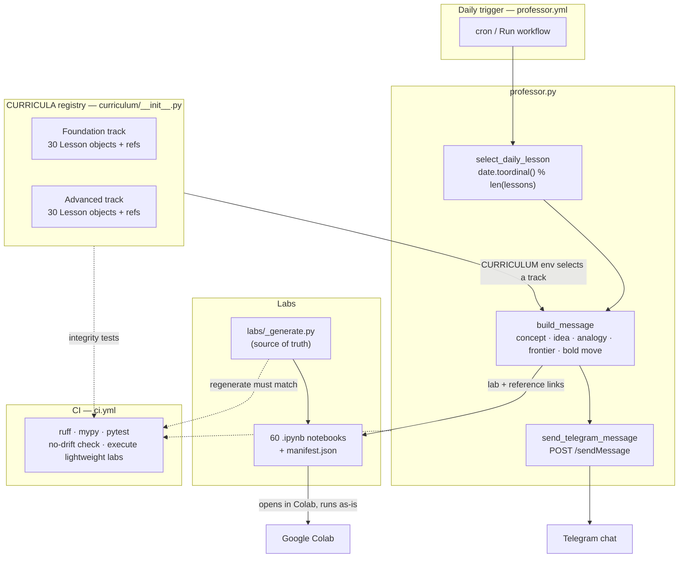

# Synapi Professor

[](https://github.com/yiyaw-lab/synapi-professor/actions/workflows/ci.yml)
[](LICENSE)

Meet **Prof. Syd** — a tiny daily professor for large language models, part of
[Synapi](https://synapi.app) by Coaur.

Every morning it picks one concept — from a **Foundation** track (how LLMs work)
or an **Advanced** track (the research-and-engineering frontier) — and sends it to
Telegram: plain explanation, a vivid analogy, a note from the current frontier,
one bold move to try, a runnable Colab lab, and a couple of curated references to
go deeper. No app to open, no streak to maintain. One idea a day, in your chat.

## What a lesson looks like

```
Good morning, Yiya.

Today’s concept: Tokens

The idea:
LLMs do not read words directly. They read tokens: small chunks of text
that may be words, word parts, punctuation, or spaces.

Picture it:
Like reading a book after every page has been cut into puzzle pieces.

On the frontier:
Token counts are the unit of billing and the hard limit of every model...

⚡ Bold move today:
Build: write a 40-line script that pastes any text, counts its tokens with
tiktoken, and prints what it would cost at GPT-4o and Claude prices.

🧪 Lab (opens in Colab, runs as-is):
https://colab.research.google.com/github/.../labs/01_tokens.ipynb

Go deeper:
https://tiktokenizer.vercel.app/
...
```

## The curriculum

There are **two 30-lesson tracks**. Pick one with the `CURRICULUM` env var
(`foundation` by default, or `advanced`); the daily bot sends from the selected
track.

### Foundation — how LLMs work

Builds from text-as-tokens up to thinking about AI systems as a whole. Suggested
pace: a 5-week path (3–5 hours/week).

| Week | Theme |
|------|-------|
| 1 | Token and embedding fundamentals |
| 2 | Core model mechanisms (attention, context, transformers) |
| 3 | Training dynamics (loss, gradients, scaling laws) |
| 4 | Reliability and failure modes |
| 5 | Alignment, evaluation, and prompting |

Lessons: [curriculum/foundation_llm.py](curriculum/foundation_llm.py) ·
plan: [curriculum/foundation_path.py](curriculum/foundation_path.py).

### Advanced — the research-and-engineering frontier

Sits on top of the foundation track: what practitioners actually *do* to a
trained model — align it, shrink it, speed it up, redesign it, read its mind, and
ship it as a system. Suggested pace: 5 weeks (4–6 hours/week).

| Week | Theme |
|------|-------|
| 1 | Post-training & preference optimization (SFT, RLHF, DPO, reasoning models) |
| 2 | Efficient models (LoRA, quantization, distillation, MoE, speculative decoding) |
| 3 | Architecture & long context (FlashAttention, Mamba, GQA, multimodal) |
| 4 | Interpretability (mech interp, SAEs, steering, model editing, grokking) |
| 5 | Agentic & production systems (tools, agents, advanced RAG, evals, serving) |

Lessons: [curriculum/advanced_llm.py](curriculum/advanced_llm.py) ·
plan: [curriculum/advanced_path.py](curriculum/advanced_path.py).

## Labs

All 60 concepts (30 per track) ship with a self-contained Jupyter notebook in
[labs/](labs/) — one per lesson. Foundation labs are numbered `NN_…`; advanced
labs are `aNN_…`. Each opens in Google Colab and runs top to bottom with
**Runtime → Run all**, no local setup required: an emoji hook, a quiet
`%pip install`, a runnable demo, a "Try it" exercise, and a closing
"🚀 Your move" challenge.

The notebooks are not hand-edited. They are generated from a single source of
truth, [labs/_generate.py](labs/_generate.py), and CI proves they still run (see
[Development](#development)).

## How it works

Each day a scheduled run picks one lesson deterministically from the date,
formats it, and posts it to Telegram. The lessons and their per-concept lab and
reference metadata live in the `CURRICULA` registry; the 60 Colab notebooks are
generated from a single source of truth, and CI guards both the code and the
notebooks against drift.



```
professor.py            entry point: pick the day's lesson, build it, send it
lesson_model.py         the Lesson dataclass
curriculum/
  __init__.py            the CURRICULA track registry (foundation + advanced)
  foundation_llm.py      the 30 foundation lessons
  foundation_metadata.py foundation notebook filenames + curated references
  foundation_path.py     the foundation 5-week study plan
  advanced_llm.py        the 30 advanced lessons
  advanced_metadata.py   advanced notebook filenames + references
  advanced_path.py       the advanced 5-week study plan
  tooling.py             recommended tools for the labs
labs/
  _generate.py          source of truth: builds all 60 notebooks
  *.ipynb               generated, Colab-runnable notebooks
  manifest.json         generated: which labs CI executes vs. structure-checks
tests/                  pytest suite (logic + curriculum/lab integrity)
.github/workflows/
  professor.yml         daily scheduled lesson
  ci.yml                lint, type-check, tests, lab execution
```

The day's lesson is chosen deterministically from the date, so everyone subscribed
to the same chat (and track) sees the same concept on the same day and the
curriculum cycles through all 30 over time. The `CURRICULA` registry in
[curriculum/__init__.py](curriculum/__init__.py) is the single source of truth for
which tracks exist; both the sender and the tests read from it.

The generator enforces an invariant — every concept (in every track) has exactly
one registered notebook, and every notebook on disk is registered — so the lab
links in each message can never point at a file that does not exist. The test
suite re-checks this per track, and CI fails if the committed notebooks ever drift
from the generator.

## Run it yourself

You'll need a Telegram bot and a chat to send to.

1. **Create a bot** with [@BotFather](https://t.me/BotFather) and copy its token.
2. **Find your chat ID** — message your bot, then visit
   `https://api.telegram.org/bot<TOKEN>/getUpdates` and read the `chat.id`.
3. **Install dependencies:**

   ```bash
   pip install -r requirements.txt
   ```

4. **Configure** — copy the template and fill in your values, then send a lesson:

   ```bash
   cp .env.example .env   # then edit .env
   python professor.py
   ```

### Configuration

Every setting is an environment variable (or a line in `.env`). The only required
ones are the two Telegram values; everything else has a sensible default.
[.env.example](.env.example) documents them all with comments.

| Variable | Required | Default | Purpose |
|----------|----------|---------|---------|
| `TELEGRAM_BOT_TOKEN` | yes | — | Bot token from BotFather |
| `TELEGRAM_CHAT_ID` | yes | — | Where to send the lesson |
| `RECIPIENT_NAME` | no | _(empty)_ | Your name in the greeting. Empty → a name-less greeting (`Good morning.`) |
| `GREETING` | no | `Good morning` | The opening line's tone (e.g. `Hey`, `Hi there`) |
| `CURRICULUM` | no | `foundation` | Which track to send: `foundation` or `advanced` |
| `TELEGRAM_API_BASE_URL` | no | `https://api.telegram.org` | Override the API host |
| `GITHUB_REPO` | no | `yiyaw-lab/synapi-professor` | Repo slug for lab links |
| `GITHUB_BRANCH` | no | `main` | Branch for lab links |

For example, `RECIPIENT_NAME=Sam` with `GREETING=Hey` opens each lesson with
*"Hey, Sam."*

> `.env` is gitignored. Never commit your bot token.

## Daily delivery via GitHub Actions

The included workflow ([.github/workflows/professor.yml](.github/workflows/professor.yml))
runs `professor.py` on a daily cron (and on demand via *Run workflow*). To use it
on your own fork:

1. Go to **Settings → Secrets and variables → Actions**.
2. Add `TELEGRAM_BOT_TOKEN` and `TELEGRAM_CHAT_ID` as repository secrets.
3. Enable Actions; the lesson will arrive each day.

## Requirements

- Python 3.10+
- [`requests`](https://pypi.org/project/requests/) and
  [`python-dotenv`](https://pypi.org/project/python-dotenv/) (see
  [requirements.txt](requirements.txt))

The labs use additional libraries (`tiktoken`, `transformers`,
`sentence-transformers`, and more) but install their own dependencies when run in
Colab. See [curriculum/tooling.py](curriculum/tooling.py) for the full list if you
prefer to run them locally.

## Development

[CONTRIBUTING.md](CONTRIBUTING.md) has the architecture diagram, where each file
lives, and how to add a lesson; [labs/README.md](labs/README.md) indexes the
notebooks.

```bash
pip install -r requirements-dev.txt

ruff check . && ruff format --check .   # lint + format
mypy                                    # type-check
pytest                                  # unit tests + curriculum/lab integrity
python labs/_generate.py                # regenerate notebooks from source
python labs/_run_light.py               # execute the lightweight labs end to end
```

CI ([.github/workflows/ci.yml](.github/workflows/ci.yml)) runs all of the above on
every push and pull request. Notebook execution is **tiered**: the lightweight
labs (`numpy`/`tiktoken` only — all 30 advanced labs plus most foundation ones)
are executed top to bottom on every push, so a broken lab fails CI. The handful
that download model weights (`transformers`/`sentence-transformers`) are validated
structurally on every push and executed on a slower cadence — the split lives in
[labs/manifest.json](labs/manifest.json), written by the generator. If you change a
lab, edit [labs/_generate.py](labs/_generate.py) (not the `.ipynb` files) and
regenerate; CI rejects any drift between the two.

## License

This project is dual-licensed by its nature — code and content are licensed
separately:

- **Code** (Python source, the notebook generator, tests, CI) — Apache License 2.0,
  © 2026 Coaur Inc. See [LICENSE](LICENSE) and [NOTICE](NOTICE).
- **Educational content** (the lessons in [curriculum/](curriculum/) and the docs) —
  [Creative Commons Attribution 4.0 (CC BY 4.0)](LICENSE-CONTENT), © 2026 Coaur Inc.
  Reuse freely, including commercially; just credit *Synapi Professor by Yiya Wang
  (Coaur Inc.)*.

Built by [Yiya Wang](https://github.com/yiyaw-lab) at Coaur.
